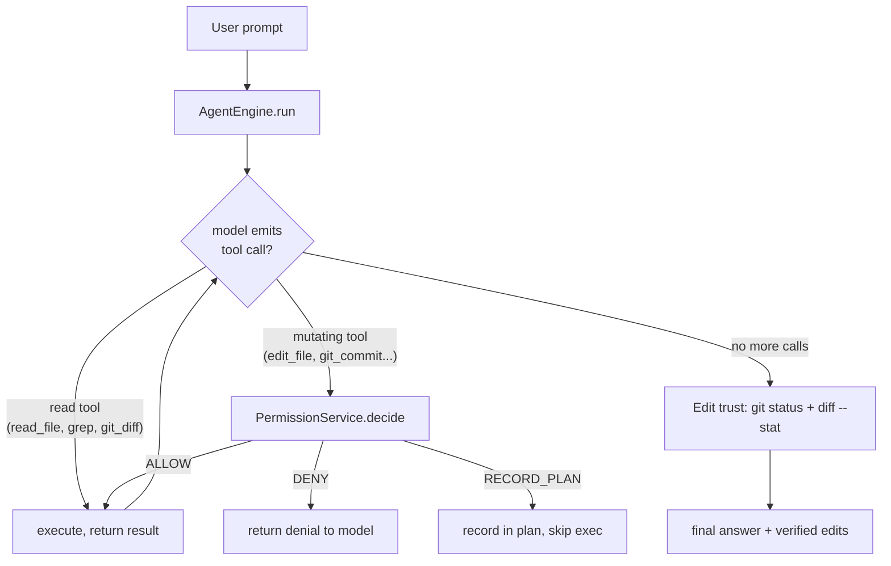
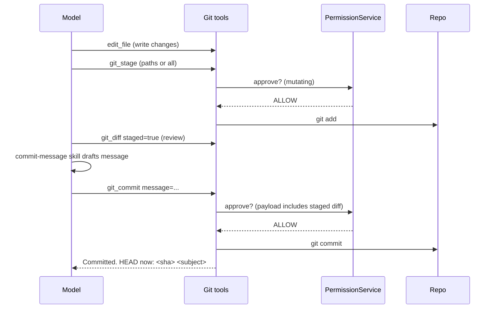
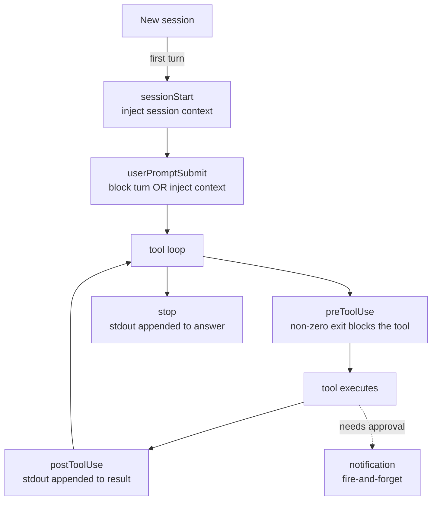
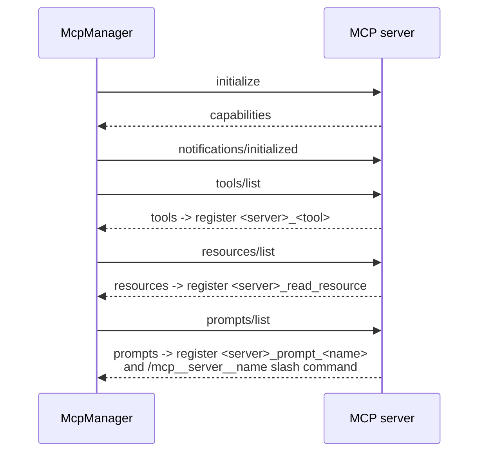
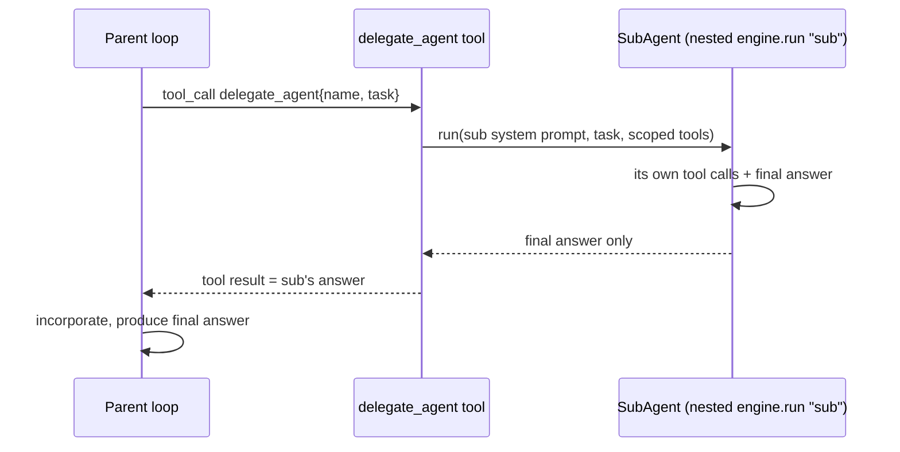

# Workflow walkthrough: edit → verify → commit, hooks, MCP, delegation, and how each branch is proven

This is a guided tour of the three workflow surfaces that make imini feel like a real coding agent: the
**edit → verify → commit loop**, the **hook lifecycle**, and the **MCP server lifecycle**. Everything here
is accurate to the code as of the current `tier3` head; file/method names are given so you can read along.

The intent is educational: each diagram is small and maps directly to a few methods, so you can open the
source next to it and see exactly where each arrow lives.

---

## 1. The edit → verify → commit loop

A coding turn is a loop: the model proposes a tool call, the permission layer decides whether it may run,
the tool runs, and after any file change imini appends a **git-verified** summary so the answer can't
overstate what happened. When the work is ready, the new write-side git tools close the loop with a commit.

The **commit** half is three mutating tools in `GitWriteTools` — `git_stage`, `git_commit`, `git_branch`
(plus `git_push`, off by default). They sit on the same `PermissionService` gate as `edit_file` and
`run_command`, so a commit is approved the same way any other mutation is. The recommended path:

Two details worth seeing in the source:

- **The staged diff is surfaced for approval.** `PermissionService.decideRemote` attaches
  `git diff --cached --stat` (via `GitInspector.diffCachedStat`) to the approval payload for
  `git_commit`/`git_stage`, so the reviewer sees what will land before clicking approve.
- **`git_commit` refuses an empty commit.** If nothing is staged (and `all=true` was not passed) it returns
  a clear error instead of creating an empty commit, and it reports the new HEAD on success.

---

## 2. The hook lifecycle

Hooks are optional shell commands configured in `hooks.json` (off entirely when the file is absent). There
are now six events spanning the whole turn. `HookService` owns them; the call sites are in `AgentEngine`,
`AgentLoop`, and `PermissionService`.

| Event | When | Effect | Env it receives |
|---|---|---|---|
| `sessionStart` | first turn of a session | stdout injected as `<session-context>` | `IMINI_SESSION` |
| `userPromptSubmit` | before a turn | non-zero exit blocks; stdout injected ahead of the prompt | `IMINI_PROMPT` |
| `preToolUse` | before a tool | non-zero exit blocks the tool (output becomes the result) | `IMINI_TOOL`, `IMINI_ARGS` |
| `postToolUse` | after a tool | stdout appended to the tool result | `+ IMINI_RESULT` |
| `notification` | agent requests approval | fire-and-forget (e.g. desktop ping) | `IMINI_NOTIFY`, `IMINI_TOOL` |
| `stop` | turn finishes | stdout appended to the final answer | `IMINI_PROMPT`, `IMINI_ANSWER` |

The guiding rule: **a hook failure never bricks the turn.** `pre`/`userPromptSubmit` can *intentionally*
block (non-zero exit), but a hook that crashes is logged and ignored.

---

## 3. The MCP server lifecycle

MCP lets imini borrow tools, resources, and prompts from external servers. It is off unless an `mcp.json`
exists. `McpManager` connects to each server (stdio child process or HTTP), runs the handshake, then
discovers everything the server offers and registers it into the normal tool registry.

Once connected:

- **Tools** become `<server>_<tool>` and run through the permission gate (MCP output is treated as
  untrusted and fenced).
- **Resources** are read via a `<server>_read_resource` tool (no args lists them; a `uri` reads one,
  calling `resources/read`).
- **Prompts** are exposed two ways: as a `<server>_prompt_<name>` tool, and as a slash command
  `/mcp__<server>__<name>` (parsed in `McpManager.renderPromptCommand`, dispatched from `AgentLoop`). The
  rendered prompt (`prompts/get`, with `key=value` arguments substituted) becomes the turn's input.

Transports are pluggable behind a small `Transport` interface: a stdio child process (newline-delimited
JSON-RPC) or an HTTP endpoint (`transport:"http"`, plain-JSON or SSE — including an unbounded, multi-event
`text/event-stream` consumed incrementally). The `McpLiveIntegrationTest` drives both against a stub server.

---

## 4. How each branch is proven (the golden-trace suite)

Every lifecycle above is backed by an automated **golden trace**: a test that drives the *real*
`AgentEngine` (and, where relevant, the real `SubAgent`/`McpManager`) with a *scripted, model-free*
`LlamaClient`, so the diagram's control flow is asserted deterministically without a live model. The
scripted model and the real-engine builder live in the shared `ScriptedAgent` test fixture. Read a trace
next to its diagram and the picture becomes executable.

| Lifecycle / branch | Diagram above | Golden-trace test (method) | What it asserts |
| --- | --- | --- | --- |
| edit → verify → commit (happy path) | §1 | `GoldenTraceWorkflowTest.editStageCommitTrace` | the file is edited and the commit lands on HEAD (dispatch), the permission gate returns `ALLOW` per mutating tool, the pre/stop hooks fire, and the git-verified edit-trust summary names the changed file |
| plan mode (nothing executed) | §1 | `RecoveryTraceTest.planModeRecordsButDoesNotExecute` | a mutating call is gated to `RECORD_PLAN`; it never runs, and the answer carries the plan suffix |
| invalid args → corrective feedback → retry | §1 | `RecoveryTraceTest.invalidArgsBecomeFeedbackThenRecover` | the first call yields `INVALID_ARGS …` (fed back, not executed); the model retries with valid args and succeeds |
| duplicate-call guard | §1 | `RecoveryTraceTest.duplicateCallGuardStopsRepetition` | repeated identical calls trip the guard NOTE, execution is capped, and the run stops |
| hook lifecycle (pre/post/stop) | §2 | `GoldenTraceWorkflowTest.editStageCommitTrace` | the `preToolUse` hook marker is written and the `stop` hook output is appended to the answer |
| capability scoping (access-control denial) | §2 | `CapabilityScopingTraceTest.toolOutsideRoleScopeIsDeniedAndNotExecuted` | an out-of-scope tool returns `outside this caller's capability scope`, is audited, and does not execute, while the in-scope tool runs |
| per-tenant rate limiting | §2 | `CapabilityScopingTraceTest.toolOverRateLimitReturnsRateLimited` | a tool over its limit returns `RATE_LIMITED` and does not execute |
| MCP server lifecycle (discover + invoke) | §3 | `McpLiveIntegrationTest.discoversAndInvokesOverStdio` / `…OverHttp` | handshake → tools/resources/prompts discovery → `read_resource` and the `/mcp__server__prompt` slash command return server-rendered content (stdio self-skips without `node`) |
| MCP prompt as a turn input | §3 | `GoldenTraceWorkflowTest.mcpPromptSlashCommandTrace` | a rendered MCP prompt reaches the model as the user turn |
| MCP multi-server namespacing/routing | §3 | `McpLiveIntegrationTest.twoServersNamespaceToolsAndRoutePromptsIndependently` | two servers expose `<server>_<tool>` without collision and `/mcp__<server>__<prompt>` routes to the right server |
| MCP streaming transport (terminating + unbounded SSE) | §3 | `McpLiveIntegrationTest.discoversAndInvokesOverStreamingSse` / `…consumesUnboundedKeepAliveSseStream` | a multi-event `text/event-stream` is consumed incrementally, skipping interim/keep-alive events to pick the JSON-RPC response |
| subagent delegation (hand-off) | §3a | `SubAgentHandoffTraceTest.parentDelegatesToSubagentAndIncorporatesItsResult` | a parent delegates to a named subagent that runs its own nested loop; the subagent's tool runs and its answer returns into the parent transcript; the parent produces the final answer |

### §3a. Subagent delegation lifecycle

Delegation reuses the same engine: the parent calls a `delegate_agent` (or `delegate_research`) tool, whose
executor runs `SubAgent.run(...)` — a *nested* `AgentEngine.run` with label `"sub"` and a scoped, read-only
tool set. The subagent's noisy intermediate context stays in its own loop; only its final answer returns to
the parent as the tool result.

These traces run fully offline (the scripted model removes the only live-server dependency); the
MCP round-trip ones are CI/live (real Jackson) and self-skip without `node`. See `TESTING.md` cases
557-568 for the run commands and per-assertion detail.

---

## Where to read next

- `GitWriteTools.java`, `GitInspector.java`, `PermissionService.java` — the commit loop and approval gate.
- `HookService.java` (+ call sites in `AgentEngine`/`AgentLoop`) — the hook lifecycle.
- `McpManager.java` — the MCP client, transports, and prompt slash commands.
- `docs/TRACE_EDIT.md` — a concrete end-to-end trace of a single edit.
- `ScriptedAgent.java` — the shared scripted-model + real-engine fixture behind the golden traces (§4).
- `TESTING.md` cases 549-568 — how each branch is tested, including the live MCP integration test and the
  golden-trace suite mapped in §4.
